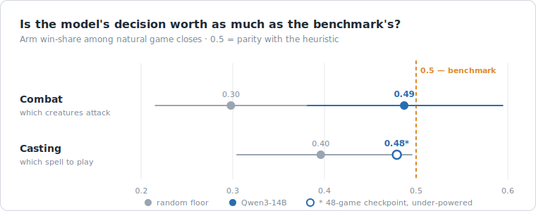
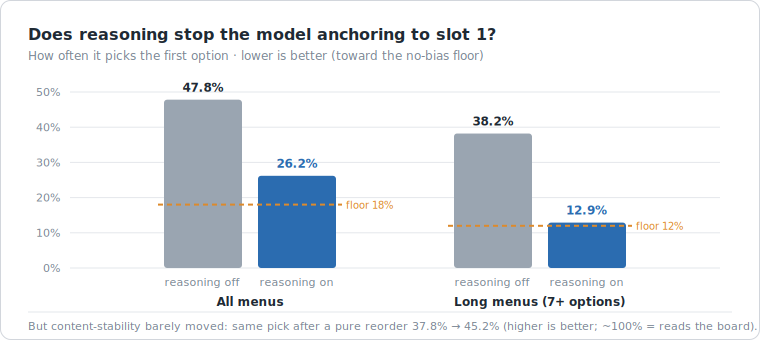
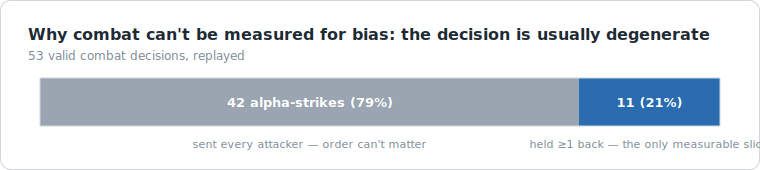

# Can a small local LLM actually *pilot* a game? Notes on measuring it

*2026-07-07*

I've been running an experiment: take a small language model that fits on one
consumer GPU (Qwen3-14B, served locally through Ollama) and have it play a full
four-player game of Magic: The Gathering — every cast, every attack, every
target — against opponents driven by a hand-tuned heuristic. Not "can it answer
rules questions." Can it *pilot*.

The interesting part turned out not to be the answer. It was that the obvious way
to ask the question doesn't work, and fixing that surfaced two findings about how
small models actually make decisions.

This post is about the measurement and what it found. No code, and the numbers
come with their caveats attached — including a batch that died two games short.

> **The hardware.** All of this runs on one consumer desktop — an AMD Ryzen 7
> 5700X3D (8 cores), 32 GB of RAM, and a single NVIDIA RTX 3080 Ti with **12 GB
> of VRAM** (a two-generation-old gaming card), on Pop!_OS. No cloud, no cluster,
> no rented H100s. That 12 GB ceiling is the constraint behind half the findings
> below: it holds exactly one 14B model at a time, so games run **sequentially**
> (one four-player game every ~4 minutes), and anything that multiplies
> per-decision cost — like turning on the model's reasoning — is felt directly in
> wall-clock. The whole point of the exercise is what you can measure *on a
> machine someone actually owns*, not in a lab.

---

## The obvious metric is a trap

The natural thing is to sit four models down, play a lot of games, and rank them
by win-rate (or Elo). In a **two-player** game that's fine. In a **four-player**
free-for-all it quietly falls apart:

- **Seat and turn order matter a lot.** Going first, or sitting to the left of
  the strongest board, swings outcomes independently of decision quality.
- **Deck strength dominates.** If the four decks aren't perfectly balanced (they
  never are), win-rate mostly measures the deck, not the pilot.
- **One win in four is the null.** With four players the signal per game is thin,
  so you need a *lot* of games — and each game is expensive when a model
  deliberates on every decision.

This isn't a hypothetical. The closest public project in this space — a benchmark
that has LLMs play real Magic through a full rules engine — rates only its
**1-vs-1** formats with Elo and explicitly marks multiplayer **Commander as
"exhibition: no rating computed."** They looked at the same problem and decided
four-player games weren't something you could put a number on. That's the problem
worth solving, not stepping around.

## What we measured instead: the model *against a benchmark*, per decision type

Two changes make it tractable.

**1. Measure relatively, not absolutely.** Don't ask "what's the model's
win-rate." Ask "does swapping *one kind of decision* from the heuristic to the
model change who wins?" Each game seats **two "arm" players** (the decision under
test is made by the LLM) and **two "control" players** (made by the heuristic).
The metric is the arm's share of wins among the two groups. If the model's
decisions are worth exactly as much as the heuristic's, that share is **0.5**.
Above 0.5, the model is better at that decision; below, worse.

**2. Counterbalance everything else.** Which decks play "arm" vs "control"
rotates through all six ways to split four seats, once per six-game block, so
every deck plays under each policy equally often. Deck strength and seat luck
then add *variance* but no *bias* — the 0.5 null holds regardless of how
unbalanced the decks are. We only count games that end naturally (not turn-capped
stalls).

The payoff: you can now ask the question **one decision surface at a time.** Is
the model's *casting* worth as much as the heuristic's? Its *combat*? Its
*targeting*? Each gets its own number against the same 0.5 null, and — crucially
— against a *random* floor (make that decision by coin-flip) that tells you
whether the surface carries any signal at all.

---

## Finding 1: where it already matches the benchmark

Two surfaces are measured so far. Both tell the same story.

| Surface | Random (coin-flip) | **Model** | Heuristic benchmark |
|---|---|---|---|
| **Combat** (which creatures attack) | 0.30 | **0.49** | 0.50 |
| **Casting** (which spell to play) | 0.40 | **0.48*** | 0.50 |

Read it in two steps. First, **random ≪ benchmark** — a coin-flip attacker wins
only 30% of the time, so combat genuinely *carries signal*; playing it well
matters. Second, **the model sits at the benchmark.** On the surfaces measured,
Qwen3-14B extracts essentially all of the signal a hand-tuned heuristic does.

That's a *null-ish* result, and I want to be honest about what it is and isn't.
It is **not** "the model is a strong player." It's "on these decisions, a small
local model already matches a benchmark someone spent real effort tuning — so
there's nothing left to iterate on here." Knowing a surface is *done* is as
useful as knowing one is broken; it tells you where **not** to spend effort.

**\* The casting caveat, stated plainly:** the casting run was supposed to be 54
games. It died at **52** — the process fell over two games short (a known
stability problem on this machine, not a code fault). The 0.48 figure is read at
the last *balanced* checkpoint, 48 games, where the counterbalancing is exact. It
is real but under-powered; I'd want a clean 54-game run before leaning on it hard.
I'm reporting it as "converging toward parity," not "parity, QED."

---

## Finding 2: the model reads the *menu*, not the board

This is the one that surprised me.

When you give the model a numbered list of legal plays, does it choose based on
what the cards *do*, or based on *where they sit in the list*? Easy to test:
present each real decision twice — once in the original order, once shuffled — and
see whether it picks the same *action*. A model reading the board picks the same
thing regardless of order. A model anchored to position keeps grabbing the same
*slot*.

Small models anchor. Hard. With the model's reasoning turned **off**, on the
casting surface:

- It picked the **first option 48% of the time** — where a no-bias baseline would
  be ~18%.
- Shuffling the menu barely moved that (48% → 44%): it was grabbing slot 1
  regardless of contents.
- It picked a **different action 62% of the time** after nothing changed but the
  order.

That's not board evaluation. That's positional bias — a well-documented failure
mode of LLMs on multiple-choice prompts, showing up here in an agent that's
supposed to be playing a game.

The fix we'd already adopted — turning the model's native **reasoning on** —
*partially* works, and "partially" is the honest word:

| Casting decisions | Reasoning OFF | Reasoning ON | No-bias floor |
|---|---|---|---|
| Picks first option (original order) | 47.8% | **26.2%** | 18.0% |
| Picks first option (7+ options) | 38.2% | **12.9%** | 12.0% |
| Same action after reorder | 37.8% | **45.2%** | ~100% |

Reasoning **halved** the slot-anchoring, and on long menus (7+ options) it
**eliminated** it — exactly the case where a big list used to pin the model to
the top. But it only lifted decision-consistency to 45%: the model still changes
its pick more than half the time when you shuffle a menu whose contents are
identical. Reasoning converted "anchored to slot 1" into "not anchored, but not
stable either." It killed the bias; it didn't buy judgment.

## Finding 3: some decisions are too easy to be measurable — and that's a finding

I tried the same position-bias test on combat and mostly couldn't run it — for a
reason worth writing down.

**79% of the model's combat decisions were "attack with everyone."** In an
aggressive board that's often the right call, and there's no ordering to be
biased about when you send the whole team. Only ~1 in 5 combat decisions actually
required holding something back — a real judgment call — and on those the model
was wildly inconsistent (it would swing between *attack with nobody* and *attack
with everybody* purely on menu order). But that discriminating slice was too
small (n≈11) to make a clean claim.

This dovetails with Finding 1. Combat "carries signal but the model matches the
benchmark" partly *because the decision is usually degenerate* — everyone
attacks, including the heuristic, so there's little judgment to separate them on.
Casting, where the model picks 1 of many, is where bias is both **measurable and
real.** The lesson: before you measure decision quality, check whether the
decision is even a choice.

## Finding 4: what "thinking" costs

Turning reasoning on isn't free. It took throughput from **~6–7 hours per 100
games to ~24 hours** — roughly 5×. And you can't buy it back by turning reasoning
off "just for speed": this model reasons whether you ask it to or not. With the
flag off, the reasoning still happens, it just spills into the answer channel and
corrupts the output. "Off" isn't a cheaper mode; it's a broken one. The real
levers for speed are model choice and prompt-cache reuse — not the reasoning
switch.

---

## What I'm *not* claiming

- **Not** that the model is a good Magic player. It matches a heuristic on two
  surfaces; that's parity on part of the game, not mastery of it.
- **Not** a complete picture. Two decision surfaces are measured (combat,
  casting). Targeting, modal choices, X-costs, and mulligans aren't yet.
- **Not** a clean casting number. See the 52-of-54 death above.
- The position-bias runs are single-seed replays of recorded decisions, not
  independent re-samples; treat them as strong directional evidence, not final
  effect sizes.

## What this is

A way to ask "can a small model handle this decision" that survives contact with
a noisy four-player game — by measuring the model *relative to a benchmark*, one
decision at a time, with everything else counterbalanced away. And two findings
that fell out of it: small local models anchor to menu position rather than
reading the board (reasoning helps but doesn't fix it), and some decisions are
too degenerate to measure at all — which is itself worth knowing before you spend
a week tuning them.

The next surfaces (targeting, mulligans) need new plumbing before they can be
raced. When they're done I'll post the full map.

---

*Setup: Qwen3-14B via Ollama on a single consumer GPU; a from-scratch rules
engine; heuristic opponents as the benchmark. The four decks are a deliberate
spread of strategies and power —
[Arabella, Abandoned Doll](https://archidekt.com/decks/16059609/dolls_kill)
(Boros go-wide tokens),
[Sergeant John Benton](https://archidekt.com/decks/7599772/sergeant_john_instant_combat_tricks_benton)
(Selesnya commander-damage voltron),
[Ghyrson Starn, Kelermorph](https://archidekt.com/decks/6396937/ghyrson_starn_slingin_pingin)
(Izzet spellslinger burn), and
[Vihaan, Goldwaker](https://archidekt.com/decks/16574615/treasures_attack_golden_sacrifice_edition)
(Mardu treasure engine) — so the counterbalancing has real deck-strength variance
to cancel out, not four near-identical lists.*
